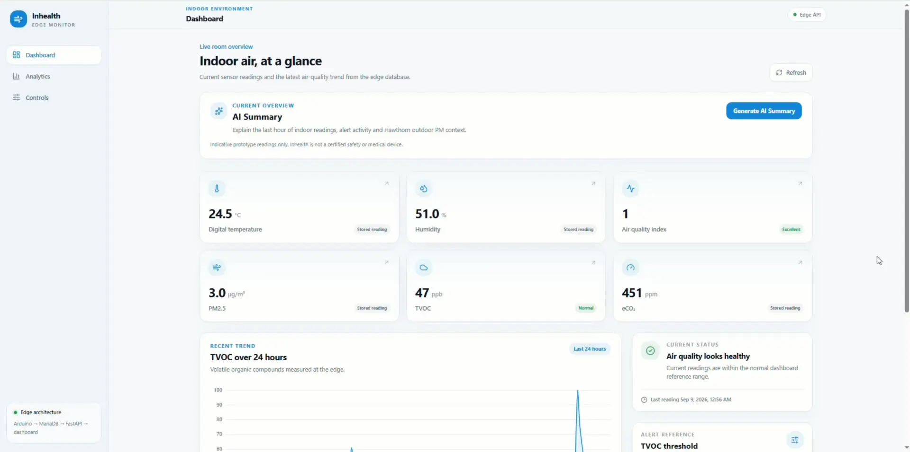
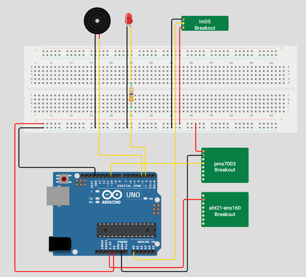

# Inhealth

Inhealth is a live indoor air-quality monitoring and control system. It combines
physical sensors, edge analytics, historical reporting and bidirectional
actuator control in one web application.

## Project preview



The dashboard displays current readings, recent trends and system health. Users
can also explore historical analytics, configure the TVOC alert threshold and
test the physical LED and buzzer.

## Live monitoring capability

When the Arduino and edge service are connected, Inhealth processes a new
environmental reading approximately every two seconds. The web application
provides:

- Live temperature, humidity, AQI, TVOC, estimated eCO2, PM1, PM2.5 and PM10.
- Recent trends and 1, 6, 12 or 24-hour historical analytics.
- Valid-sample counts with minimum, average and maximum values.
- Edge and Arduino connectivity status with the latest reading time.
- A configurable TVOC alert threshold evaluated by the edge rule engine.
- Remote LED and buzzer testing with commands sent back to the Arduino.

The dashboard continues to show stored history when the physical edge device is
offline. Live readings and actuator control resume when the edge connection is
restored.



The prototype combines analog, I2C and UART sensors with visual and audible
actuators. These images were extracted from the submitted project report.

## Architecture

```text
Sensors -> Arduino -> Edge service -> MariaDB -> FastAPI/Vue -> User
              ^                                            |
              +----------- ALERT_ON / ALERT_OFF -----------+
```

The edge service is the only process that opens the Arduino USB connection. 
It validates readings, stores them, evaluates the TVOC alert rule and sends actuator commands. 
FastAPI serves both the API and the built Vue application.


## Run locally from a fresh Windows checkout

### Prerequisites

Install these tools before continuing:

- Python 3.12 or newer, including `pip` and `venv`.
- Node.js and pnpm. If Node.js is installed but pnpm is not, run
  `corepack enable`, then `corepack prepare pnpm@latest --activate` from an
  administrator terminal.
- MariaDB Server and its command-line client.

The steps below were verified with Python 3.12, Node.js 24 and pnpm 11.

### 1. Install the application dependencies

Open PowerShell in the extracted project directory:

```powershell
py -3 -m venv .venv
.\.venv\Scripts\python.exe -m pip install -r requirements.txt
pnpm --dir frontend install --frozen-lockfile
```

If the `py` launcher is unavailable but `python` works, use
`python -m venv .venv` instead.

### 2. Configure MariaDB

Start MariaDB, then open its client as an administrative database user:

```powershell
mysql -u root -p
```

At the MariaDB prompt, apply the schema using the full path to this checkout:

```sql
SOURCE C:/full/path/to/Inhealth/database/schema.sql;
```

The database account used by the application needs `SELECT`, `INSERT` and
`UPDATE` access to `temperature_db`. Copy the example configuration and enter
that account's real password:

```powershell
Copy-Item .env.example .env
notepad .env
```

At minimum, check `DB_HOST`, `DB_PORT`, `DB_NAME`, `DB_USER` and `DB_PASSWORD`.
The `.env` file is ignored by Git and must not be committed.

The Arduino is not required to open the web application, but pages will not
contain live readings until the edge service is connected and inserting data.

### 3. Start the backend

In the first PowerShell terminal, from the project directory:

```powershell
.\.venv\Scripts\python.exe -m uvicorn backend.app.main:app --reload --port 8000
```

Verify the backend at `http://127.0.0.1:8000/health`. It should return
`{"status":"ok"}`. API documentation is available at
`http://127.0.0.1:8000/docs`.

Port `8000` is required for local development because the Vite configuration
proxies `/api` and `/health` requests to that port.

### 4. Start the frontend

In a second PowerShell terminal, from the project directory:

```powershell
pnpm --dir frontend run dev
```

Open the address printed by Vite, normally `http://localhost:5173`. Confirm that
`http://localhost:5173/health` also returns `{"status":"ok"}`; this verifies
that the frontend proxy can reach FastAPI.

### Optional: test the production build locally

```powershell
pnpm --dir frontend run build
```

Restart FastAPI if it was already running, then open
`http://127.0.0.1:8000`. FastAPI serves `frontend/dist` when that build exists.

## Edge VM

Connect from Windows PowerShell:

```powershell
ssh -p 2222 admin@127.0.0.1
```

Then check the services inside the VM:

```sh
sudo systemctl status inhealth-backend inhealth-edge
sudo journalctl -u inhealth-edge -n 40 -f
```

Open `http://<VM-IP>:8000` for the final edge-hosted application. Run
`hostname -I` in the VM if its address has changed.

## Bash setup helper

`setup.sh` provides the equivalent dependency setup for Linux, WSL or Git Bash.
It cannot run directly in a standard Windows PowerShell session. You must first
install Python, Node.js, pnpm and MariaDB/MySQL; the script does not install
those system tools.

On its first run, the helper copies `.env.example` to `.env` and stops so that
you can enter the database credentials. Run it again after saving `.env`.
Database initialization is optional and never loads demonstration seed data.

```sh
./setup.sh local
./setup.sh local --init-db
./setup.sh vm
./setup.sh vm --init-db
```

See [deploy/README.md](deploy/README.md) before running VM setup or replacing an
existing deployment.

## Quick deployment from Windows

Build the frontend before copying the project to the VM:

```powershell
cd frontend
pnpm install
pnpm run build
cd ..
scp -P 2222 -r . admin@127.0.0.1:/home/admin/inhealth/webapp
```

Inside the VM, preserve or create `.env`, then install and start the services:

```sh
cd /home/admin/inhealth/webapp
chmod +x setup.sh
./setup.sh vm
hostname -I
```

Open `http://<VM-IP>:8000`. The included `frontend/dist` directory is the
verified production build, so the VM does not need Node.js for normal runtime.

## Hardware

| Component | Interface | Purpose |
| --- | --- | --- |
| LM35 | A0 | Analog temperature |
| AHT21 | I2C A4/A5 | Digital temperature and humidity |
| ENS160 | I2C A4/A5 | AQI, TVOC and eCO2 |
| PMS7003 / D7 | UART RX D10 | PM1, PM2.5 and PM10 |
| Red LED | D2 | Visual alert |
| Active buzzer | D3 | Audible alert |

## Main features

- Bidirectional Arduino-to-edge serial communication.
- MariaDB storage for readings and control settings.
- Validation with `NULL` for unavailable sensor values.
- Configurable TVOC threshold and manual alert override.
- Dashboard with current readings and historical charts.
- Minimum, average and maximum analytics.
- Vue production build hosted by FastAPI on the edge VM.
- Optional AI Summary: an on-demand Dashboard overview combines the latest hour
  of compact MariaDB statistics and alert events with optional Open-Meteo/CAMS
  modelled Hawthorn PM context, then asks Gemini for a short report. AI never
  controls actuators.

## Alert rule

Automatic mode:

```text
TVOC > threshold  -> ALERT_ON
TVOC <= threshold -> ALERT_OFF
```

Manual mode:

```text
Test Alert -> manual override -> ALERT_ON
Stop Alert -> automatic mode
```

Changing the threshold can change the actuator state even when the latest sensor
reading has not changed.

## Key files

| Location | Responsibility |
| --- | --- |
| `firmware/arduino_sketch.ino/arduino_sketch.ino` | Arduino sensors, PMS parsing and actuators |
| `edge/main.py` | Edge ingestion and alert loop |
| `edge/sensor_parser.py` | Serial parsing and validation |
| `edge/analytics.py` | TVOC/manual alert decision |
| `database/schema.sql` | MariaDB schema |
| `backend/app/main.py` | FastAPI and Vue production hosting |
| `frontend/src/views/` | Dashboard, Analytics and Controls |
| `deploy/` | VM service files and deployment guide |
